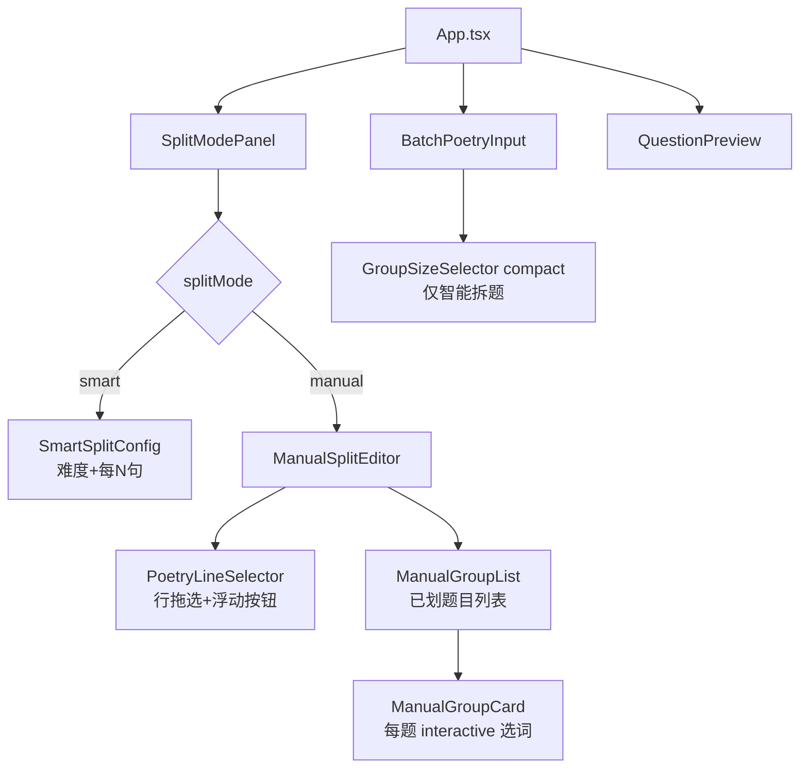

## 用户需求

重构诗词填空生成器的整体交互流程，从「繁琐的多步配置」改为「输入即触发、两步式拆题」模式。

## 产品概述

用户在输入诗词后（自动识别标题作者），立即进入「拆题模式选择」——不再需要分散在多处的难度/分题/选词等控件。单首和批量模式均支持智能拆题；单首模式额外支持手动拆分（鼠标拖选行划定题目范围，再对每题单独选词）。

## 核心功能

### 拆题模式选择器（替换现有 GroupSizeSelector + InteractiveFillBlanks 的分散布局）

- 两个 Radio 切换：**智能拆题** / **手动拆分**（批量模式仅展示智能拆题）
- 切换后对应区域在同一卡片内展开，减少页面跳转感

### 智能拆题模式

- 设置「每 N 句一题」（选项：不拆分 / 每2句 / 每4句 / 每6句），默认「不拆分（整首一题）」
- 选择难度（简单 / 中等 / 困难 / 整句填空），与拆题设置并排展示
- 点击「生成」按钮即可输出，无需其他步骤

### 手动拆分模式（仅单首）

- 展示诗词全文框，每行作为独立可选单元，视觉上清晰分行
- 用户通过**鼠标拖选若干行**来划定题目范围，选中行高亮
- 松开鼠标后在选区右上角出现**浮动「添加为第 N 题」按钮**，点击确认归入该题
- 已划定的题目显示在下方题目列表中，支持删除单题、清空全部
- 每道题卡片内：展示该题含有的诗词行，用户可逐行点击字符选择填空词（复用现有 `generateInteractiveBlanks` / `applyManualBlanks` 逻辑）
- 全部题目设置完毕后，点击「生成」按钮输出

### 批量模式保持不变的部分

- 多首诗词卡片列表、折叠/展开、解析逻辑不变
- 仅将每首卡片底部的 `GroupSizeSelector compact` 版整合进新的「智能拆题」面板中

## 技术栈

沿用现有项目栈：React 18 + TypeScript + Vite + Tailwind CSS 3.4，组件库复用项目内已有 CSS class（`stitch-*`、`exam-*`、`difficulty-selector` 等）。

---

## 实现思路

### 核心改造策略

将原本散落在左侧面板的「难度选择 → 分题设置 → 手动选词」三块独立控件，**合并为一个统一的「拆题配置卡片」**，内部用 Radio Tab 切换「智能 / 手动」两种子模式。

- 智能模式：难度 + 每N句 并列，一键生成，逻辑复用现有 `groupQuestions` + `generateFillBlankQuestions`  
- 手动模式：新建 `ManualSplitEditor` 承载行拖选 + 浮动按钮 + 已划题目 + 每题选词

### 行拖选实现

使用 `mousedown / mousemove / mouseup` 原生事件跟踪起止行索引，配合 React state 记录 `selecting: {start, end}` 范围；松开时计算选区并展示浮动按钮（absolute 定位，跟随选区最后一行的右上角）。不依赖 `document.getSelection()`，避免文本选中与行选中冲突。

### 手动题目数据结构

```ts
interface ManualGroup {
  id: number;              // 题号
  lineIndices: number[];   // 选中的行下标（相对于全文行数组）
  lineData: LineInteractiveData[];  // 每行的交互填空数据（复用现有类型）
}
```

`ManualGroup[]` 存储在 `App.tsx` state 中；点击「生成」时调用 `applyManualBlanks(group.lineData)` 并附加 `title/author`，与现有 `QuestionGroup` 格式对齐。

### App.tsx state 重构要点

- 新增 `splitMode: 'smart' | 'manual'`（单首）
- 移除 `singleGroupSize` 独立 state，改由新 `SplitModePanel` 内部管理，通过回调上报
- `handleGenerate` 在 `splitMode === 'manual'` 时从 `manualGroups` 组装 `QuestionGroup[]`，否则走原来 `groupQuestions` 路径
- `InteractiveFillBlanks` 整组件**不再直接在 App 中渲染**，其内部逻辑（`generateInteractiveBlanks` / `applyManualBlanks`）通过 `ManualSplitEditor` 调用

### 性能注意

- 行拖选的 `mousemove` 事件只在 `mousedown` 激活后监听（`isSelecting` flag），松开立即移除监听，避免不必要的 re-render
- `ManualGroup[]` 更新时只 diff 变化的 group，不整体重建

---

## 架构设计



---

## 目录结构

```
src/
├── types/
│   └── index.ts                     # [MODIFY] 新增 SplitMode 类型、ManualGroup 接口
├── components/
│   ├── SplitModePanel.tsx            # [NEW] 拆题配置总面板（智能/手动 Radio + 子面板切换）
│   ├── SmartSplitConfig.tsx          # [NEW] 智能拆题子面板（难度选择 + 每N句选择，内联展示）
│   ├── ManualSplitEditor.tsx         # [NEW] 手动拆分编辑器（行选择 + 浮动按钮 + 已划题目列表）
│   ├── GroupSizeSelector.tsx         # [MODIFY] compact 版保留（供批量卡片用），完整版可移除或保留供 SmartSplitConfig 复用
│   ├── DifficultySelector.tsx        # [KEEP] 不变，由 SmartSplitConfig 内引用
│   ├── BatchPoetryInput.tsx          # [MODIFY] 移除旧 GroupSizeSelector 独立引用（已在卡片底部），保留逻辑
│   ├── QuestionPreview.tsx           # [KEEP] 不变
│   └── InteractiveFillBlanks.tsx     # [DEPRECATE/KEEP] App 不再直接引用；其工具函数继续被 ManualSplitEditor 调用
├── utils/
│   └── fillGenerator.ts             # [KEEP] 不变，generateInteractiveBlanks / applyManualBlanks 被 ManualSplitEditor 内部调用
└── App.tsx                           # [MODIFY] state 重构：新增 splitMode / manualGroups；移除 singleGroupSize 独立 state；handleGenerate 分支更新；JSX 替换为 SplitModePanel
```

---

## 关键类型定义

```ts
// types/index.ts 新增
export type SplitMode = 'smart' | 'manual';

export interface ManualGroup {
  id: number;
  lineIndices: number[];          // 属于本题的行下标（全文行数组）
  lineData: LineInteractiveData[]; // 每行的字符 + 选词状态
}
```

```ts
// SplitModePanel props
interface SplitModePanelProps {
  mode: SplitMode;
  onModeChange: (m: SplitMode) => void;
  // 智能模式
  difficulty: DifficultyLevel;
  onDifficultyChange: (d: DifficultyLevel) => void;
  groupSize: GroupSize;
  onGroupSizeChange: (g: GroupSize) => void;
  totalLines: number;
  // 手动模式（仅单首）
  poetryInput?: PoetryInput;
  manualGroups: ManualGroup[];
  onManualGroupsChange: (groups: ManualGroup[]) => void;
  inputMode: 'single' | 'batch';
}
```

## 设计方向

延续项目现有的「古典纸张风格」（paper/amber 色系，Noto Serif SC 字体，stitch-card 卡片），在此基础上提升拆题配置区的层次感和操作流畅度。

### 拆题模式切换

- 两个 Radio 按钮采用「分段控件」样式（类似 iOS segmented control），选中态用琥珀色背景 + 白色文字，未选态用纸张底色 + 灰色文字
- 切换时内容区平滑高度过渡（CSS transition + max-height）

### 智能拆题子面板

- 难度 + 每N句 采用横向两列布局（难度占60%，每N句占40%），在同一卡片内紧凑展示
- 选项采用小号圆角 pill 按钮，活跃态琥珀色，减少视觉层级

### 手动拆分编辑器

- 诗词全文框：每行一个「行块」，默认淡灰色边框，鼠标悬停淡黄色高亮，**拖选状态**深琥珀色背景
- 已划入题目的行：用带删除线的低对比度样式标注（已分配），防止重复选取
- 浮动按钮：绝对定位，白底 + 琥珀色描边 + 阴影，「+ 添加为第N题」文字，淡入动画
- 已划题目列表：每张题目卡片左侧有彩色竖条（按题号区分色相），卡片内展示行内容 + 字符选词区

### 交互动效

- 行拖选时实时高亮，松开后浮动按钮 fadeIn（0.15s）
- 题目卡片添加时 slideDown（0.2s）
- 模式切换内容区 0.2s height 过渡